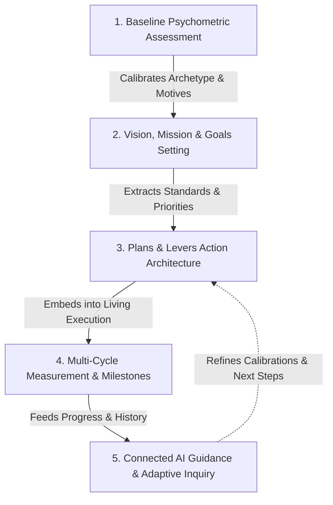
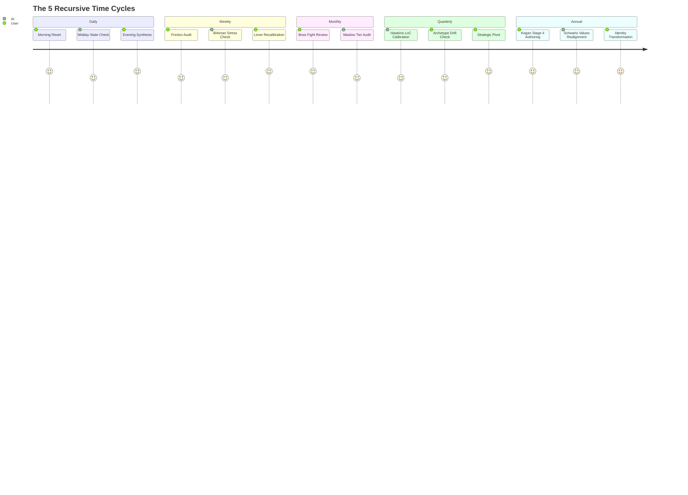

# 🧠 AI Question Generation Protocol (MatchWise Clinical Standard)

> [!summary] Protocol Overview
> This specification defines the standardized cognitive and behavioral questioning protocol for any connected AI inside **LifeOS** (`/api/ai/questions`, `/api/ai/analyze`, `/api/ai/chat`, and development agents). Built by synthesizing empirical psychometrics from the **MatchWise** project (`D:\AI\MatchWise`), this engine enables an AI to generate surgically calibrated reflection questions and multiple-choice options tailored to the user's psychological situation and time cycle.

---

## 1. The 5-Phase End-to-End System Lifecycle

LifeOS guides the user through five progressive developmental phases:

1. **Assessment Phase**: Identifies psychological baseline, primary motives, and underlying needs using multi-framework tests.
2. **Vision & Mission Phase**: Formulates Anti-Vision (intolerable compromises), true Vision, life Mission, and Schwartz-grounded 1-Year Goal.
3. **Planning & Levers Phase**: Derives high-leverage daily tasks and monthly "Boss Fight" projects matched to DISC tempo and Birkman stress recovery.
4. **Multi-Cycle Measurement**: Measures progress recursively across **Daily**, **Weekly**, **Monthly**, **Quarterly**, and **Annual** horizons.
5. **Connected AI Experience**: Injects tailored inquiries, eliminates journal resistance, and halts reactive spirals.

---

## 2. The 5 Recursive Time Cycles

| Cycle | Primary Focus | Psychological Frameworks | Key AI Question Objective |
| :--- | :--- | :--- | :--- |
| **Daily** | Morning posture, midday interrupt, evening synthesis | Hartman Motives, DISC Pace, Hicks Emotional Scale | Calibrate immediate execution tempo and arrest morning resistance. |
| **Weekly** | Friction audit, lever adherence, habit defense | Birkman Needs & Stress, TKI Conflict, DISC | Identify which stress trigger was tripped (chaos/restriction/conflict/dismissal). |
| **Monthly** | "Boss Fight" milestone evaluation, project pacing | Maslow Needs Hierarchy (D-needs vs B-growth) | Check if deficiency needs hijacked bandwidth from creative actualization. |
| **Quarterly** | Psychological drift check, Hawkins LoC calibration | Hawkins Map of Consciousness (Power vs Force) | Evaluate whether decisions stem from Power (>=200) or reactive fear/pride (<200). |
| **Annual** | Identity evolution, Vision & Mission trajectory | Kegan Orders of Mind, Schwartz Basic Values | Assess whether the user is truly self-authoring or relapsing into socialized scripts. |

---

## 3. The 14 Frameworks Matrix for AI Questioning

Derived directly from MatchWise (`D:\AI\MatchWise\Vault\Progress\Frameworks`):

1. **Dr. Taylor Hartman Color Code ([[Hartman Color Code|Core Motives]])**:
   - `Red`: Probes tangible impact, leadership, decisiveness, and accountability.
   - `Blue`: Probes depth, meaning, emotional connection, loyalty, and craft standards.
   - `White`: Probes autonomy, clarity, low drama, and quiet mental space.
   - `Yellow`: Probes playful enthusiasm, variety, spontaneous energy, and novelty.

2. **DISC Assessment ([[DISC Assessment|Pace & Focus]])**:
   - `D`: High-intensity 90-minute power blocks attacking the hardest obstacle first.
   - `I`: Dynamic creative sprints with interactive feedback and high variety.
   - `S`: Predictable, unhurried, steady cadence protecting peace.
   - `C`: Methodical systems, detailed checklists, and analytical precision.

3. **The Birkman Method ([[The Birkman Method|Usual, Needs, Stress]])**:
   - Compares productive *Usual Behavior* against subconscious *Underlying Needs* (`freedom`, `structure`, `empathy`, `esteem`).
   - Diagnoses reactive *Stress Triggers* (`chaos`, `restriction`, `conflict`, `dismissal`) when needs are ignored.

4. **David Hawkins Map of Consciousness ([[Hawkins Map of Consciousness|Force vs Power]])**:
   - Pivot point at **200 Courage**.
   - Questions probe whether current resistance represents *Force* (fear, pride, guilt, apathy) or *Power* (courage, willingness, acceptance, reason).

5. **Abraham Hicks Emotional Guidance Scale ([[Hicks Emotional Guidance Scale]])**:
   - 22 calibrated emotional set-points to diagnose upward or downward spirals.

6. **Abraham Maslow Hierarchy of Needs ([[Maslow Hierarchy of Needs|6 Tiers]])**:
   - Evaluates whether energy is held back by deficiency needs (D-needs: sleep, safety, belonging) before attempting self-actualization or transcendence (B-needs).

7. **Schwartz Theory of Basic Human Values ([[Schwartz Basic Values]])**:
   - Grounds 1-Year Goals and Vision in trans-situational motivators (Self-Direction, Achievement, Benevolence, Security).

8. **Robert Kegan Orders of Mind ([[Kegan Orders of Mind & Bowen Differentiation]])**:
   - Distinguishes Stage 3 (Socialized Mind: governed by other people's approval) from Stage 4 (Self-Authoring Mind: internally generated operating system).

9. **Adult Attachment Theory ([[Adult Attachment (ECR)]])**:
   - Probes relationship friction (Anxious-Preoccupied vs Dismissive-Avoidant) during team and partner collaboration.

10. **Thomas-Kilmann Conflict Modes ([[TKI Conflict Modes]])**:
    - Assesses whether the user handles project bottlenecks by Competing, Collaborating, Compromising, Avoiding, or Accommodating.

11. **Gottman Sound Relationship House ([[Gottman Relationship House]])**:
    - Detects defensiveness, stonewalling, and contempt in shared goals.

12. **FIRO-B Reciprocity ([[FIRO-B Reciprocity]])**:
    - Expressed vs Wanted control, inclusion, and affection.

13. **Big Five / OCEAN ([[Big Five (OCEAN)]])**:
    - Trait baseline tracking Openness, Conscientiousness, Extraversion, Agreeableness, and Neuroticism.

14. **MBTI & Cognitive Functions ([[MBTI & Cognitive Functions]])**:
    - Intuitive vs Sensing perception and Thinking vs Feeling decision filters.

---

## 4. Critical Anti-Idealization Rules (MatchWise Heuristic)

> [!danger] Prevent "Idealized Fantasy" Reporting
> When users are asked open-ended questions like "What are your values?", they invariably pick high-status, abstract virtues ("I value honesty, love, and wisdom"). This corrupts the assessment and creates useless, generic AI advice.

### The 4 Mandates for AI Question Generation:

1. **Concrete Behavioral Trade-offs Only**:
   - Every option must represent an actual observable behavior or trade-off (e.g., instead of *"I choose discipline"*, use *"Block out phone notifications for 90 minutes and tackle the single highest-friction file"*).
2. **Include the Shadow / Stress Reaction**:
   - Always include at least one option reflecting honest stress behavior (e.g., *"Felt overwhelmed and withdrew into passive scrolling or busywork"*).
3. **Cycle Pacing Match**:
   - Daily questions must be solvable today; Weekly questions must audit the last 7 days; Monthly questions must review milestone delivery; Quarterly questions must probe identity drift.
4. **Bilingual Parity**:
   - In English: sharp, punchy, stoic, and non-judgmental.
   - In Arabic: elegant, grammatically pure الفصحى, using culturally grounded personal development terminology.

---

## 5. Technical Implementation in LifeOS

- **Engine Core:** [`src/lib/ai-question-engine.ts`](file:///D:/AI/CLOD/life-os/src/lib/ai-question-engine.ts)
- **API Endpoint:** [`src/app/api/ai/questions/route.ts`](file:///D:/AI/CLOD/life-os/src/app/api/ai/questions/route.ts)
- **Test Suite:** [`tests/ai-question-engine.test.mjs`](file:///D:/AI/CLOD/life-os/tests/ai-question-engine.test.mjs)
- **Offline Resiliency:** `generateOfflineFallbackQuestion` guarantees instant, clinically grounded question generation even if offline or without an active API key.

---

## 🔗 Vault Navigation

- **Parent MOC:** [[00 - Start Here]]
- **Human Development Frameworks:** [[Frameworks/Human Development Frameworks]]
- **Progress Dashboard:** [[Progress/00 - Dashboard]]
- **Dan Koe Principles:** [[Frameworks/Dan Koe Principles]]
