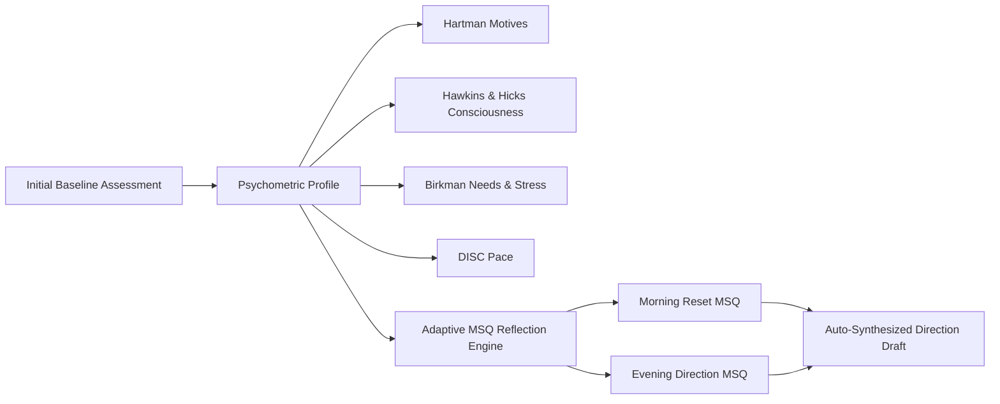

# Human Development Frameworks

> [!summary]
> Synthesizing clinical and behavioral psychometrics from the **MatchWise** project (`D:\AI\MatchWise`) with Dan Koe's one-day reset and daily reflection protocol in LifeOS. This system eliminates manual journal fatigue by using an **Initial Baseline Assessment** and **AI-calibrated Multiple-Choice Questions (MSQs)**.

---

## 1. The Core Architecture

In the initial design of LifeOS, users faced 14 open-ended morning prompts and 7 evening prompts every day. Writing long essays daily caused severe cognitive resistance and abandonment.

By integrating the human development frameworks from **MatchWise**, LifeOS translates subjective reflection into **calibrated behavioral vectors**:

---

## 2. Framework Breakdown & LifeOS Mapping

### 2.1 Dr. Taylor Hartman Color Code (Core Motives)
- **Red (Power & Results):** Driven by tangible impact, leadership, execution, and high-agency leverage.
- **Blue (Intimacy & Quality):** Driven by deep meaning, authentic connection, loyalty, and craft excellence.
- **White (Peace & Clarity):** Driven by serenity, autonomy, low drama, and quiet mental space.
- **Yellow (Fun & Vitality):** Driven by creative play, enthusiasm, novelty, and celebratory energy.
- **LifeOS Role:** The user's core motive sorts and tailors the options presented in morning questions `m1` to `m14`.

### 2.2 David Hawkins Map of Consciousness (Force vs. Power)
- **Levels < 200 (Force / Reactive Resistance):** Pride, Anger, Desire, Fear, Grief, Apathy, Guilt, Shame. Manifests in procrastination, avoidance, and blame.
- **Levels ≥ 200 (Power / Generative Growth):** Courage (200), Neutrality (250), Willingness (310), Acceptance (350), Reason (400), Love (500), Peace (600).
- **LifeOS Role:** Calibrates daily operating posture. Evaluates whether the user's Anti-Vision is driving reactive anxiety (Force) or intentional responsibility (Power).

### 2.3 Abraham Hicks Emotional Guidance Scale
- **Continuum:** 22 emotional set points ranging from Joy/Appreciation (1) down to Fear/Despair (22).
- **LifeOS Role:** Daytime interrupts and mood check-ins allow quick-tap emotional alignment, tracking whether the user is in an upward or downward spiral without requiring long journal entries.

### 2.4 The Birkman Method (Tri-Layer Behavior)
- **Usual Style:** How the person naturally behaves when productive.
- **Underlying Needs:** What the individual requires from their schedule, environment, and peers to thrive (e.g., Need for Freedom vs. Need for Structure).
- **Stress Triggers & Behavior:** How the person reacts when their needs are violated (Withdrawing, Demanding, Digging in, Resisting).
- **LifeOS Role:** Directly powers the **Constraints** field and Anti-Vision in the direction draft.

### 2.5 DISC Assessment (Pace & Focus)
- **D (Dominance):** Fast pace, task focus. Thrives on 90-minute uninterrupted power blocks.
- **I (Influence):** Fast pace, people/creative focus. Thrives on dynamic creative sprints.
- **S (Steadiness):** Steady pace, people/harmony focus. Thrives on unhurried, ritualized daily cadence.
- **C (Conscientiousness):** Methodical pace, detail focus. Thrives on analytical checklists and deep precision.
- **LifeOS Role:** Shapes the rhythm of **Daily Levers** and monthly Boss Fight milestones.

### 2.6 Schwartz Theory of Basic Human Values
- Identifies universal human motivators: Self-Direction, Mastery/Achievement, Security/Harmony, Benevolence/Impact.
- **LifeOS Role:** Grounding the **1-Year Goal** and **Vision** in lasting trans-situational values.

---

## 3. The MSQ Reflection Experience

Rather than writing answers from scratch:
1. The user takes an 8-question **Baseline Assessment** once during onboarding (or via Settings).
2. For each reflection prompt (morning `m1..m14` and evening `e1..e7`), the app presents 3–4 high-signal option cards aligned with their archetype.
3. Users tap to select the closest match (or multiple matches) in seconds.
4. An optional "Personal nuance" text area remains available if they wish to add a custom note.
5. With an active AI provider, users can tap **"Generate AI-tailored choices"** to synthesize fresh options contextualized to today's active goals.
6. Selected choices automatically synthesize into their **Direction Draft** (`Anti-Vision`, `Vision`, `Identity`, `Daily Levers`, and `Constraints`).

---

## 4. Vault Navigation

- **Parent MOC:** [[00 - Start Here]]
- **Milestone Log:** [[00 - Dashboard]]
- **Dan Koe Protocol:** [[Dan Koe Principles]]
- **Technology Stack:** [[Tech Stack]]
